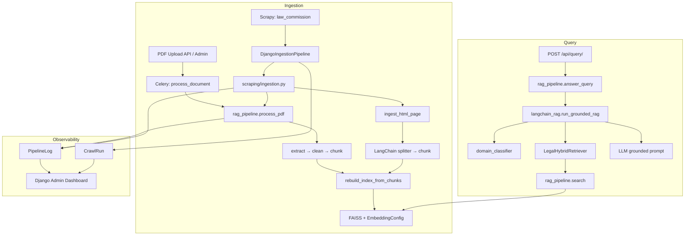

# Architecture Audit Report — Legal Information Assistance System

Generated after production-readiness refactor (Scrapy, RAG pipeline, Admin, observability).

---

## Project Architecture Diagram



---

## Correct Flow (Verified Design)

| Step | Component | File |
|------|-----------|------|
| 1. Crawl | Scrapy spider discovers URLs | `backend/scraper/scraper/spiders/law_commission_spider.py` |
| 2. Download | Scrapy downloader (SSL relaxed for .gov.np) | `backend/scraper/scraper/middlewares.py` |
| 3. Ingest | Pipeline calls Django services | `backend/scraper/scraper/pipelines.py` |
| 4. Extract/Clean | PDF: pdf_loader + text_cleaning; HTML: BeautifulSoup | `services/pdf_loader.py`, `services/text_cleaning.py` |
| 5. Chunk | PDF: SmartLegalChunker; Web: LangChain splitter | `services/smart_chunking.py`, `services/langchain_splitter.py` |
| 6. Embed + Index | rebuild_index_from_chunks (deferred per crawl) | `services/rag_pipeline.py` |
| 7. Retrieve | Hybrid FAISS + keyword + rerank | `services/rag_pipeline.search` |
| 8. RAG | LangChain prompt + LLM | `services/langchain_rag.py` |

---

## Broken Components (Fixed)

| Issue | Fix |
|-------|-----|
| Spider re-fetched every page via `requests` (duplicate download) | Spider yields items; pipeline ingests response body |
| PDF SSL failures on `repository.lawcommission.gov.np` | `RelaxedSSLContextFactory` + `SCRAPER_VERIFY_SSL=False` |
| FAISS rebuilt on every single page (slow, race-prone) | Deferred rebuild in `spider_closed` |
| Duplicate spider in `legal_ai/scrapers/` | Deleted; canonical spider in `backend/scraper/` |
| `allowed_domains` missing repository subdomain | Added all lawcommission host variants |
| No crawl tracking | Added `CrawlRun` + `PipelineLog` models |
| Inconsistent imports (`legal_ai` vs full path) | Standardized on `legal_information_assistance_system.legal_ai` |

---

## Working Components

- FAISS vector store (`storage/vector_db.py`)
- E5 embeddings (`services/embedding.py`)
- Hybrid retrieval + reranker
- LangChain grounded RAG query path
- Domain classifier
- Django REST query/upload APIs
- React markdown chat UI

---

## File Code Review

| File | Used? | Called By | Verdict |
|------|-------|-----------|---------|
| `rag_pipeline.py` | Yes | API, admin, ingestion, retriever | **Keep** — ingestion + search core |
| `langchain_rag.py` | Yes | `rag_pipeline.answer_query` | **Keep** — query orchestration only |
| `langchain_retriever.py` | Yes | `langchain_rag` | **Keep** — LangChain adapter over search |
| `langchain_embeddings.py` | Partial | Not wired to FAISS rebuild | **Keep** — future LangChain loaders |
| `langchain_splitter.py` | Yes | `scraping/ingestion` | **Keep** |
| `web_ingestion.py` | Yes | Backward-compat re-export | **Keep shim** |
| `scraping/ingestion.py` | Yes | Scrapy pipeline, API | **Keep** — canonical ingestion |
| `scraping/http.py` | Yes | Fallback discovery | **Keep** |
| `pipeline/observability.py` | Yes | rag_pipeline, ingestion | **Keep** |
| `domain_classifier.py` | Yes | langchain_rag | **Keep** |
| `embedding.py` | Yes | rag_pipeline | **Keep** |
| `hybrid_retrieval.py` | Yes | rag_pipeline.search | **Keep** |
| `reranker.py` | Yes | rag_pipeline.search | **Keep** |
| `smart_chunking.py` | Yes | process_pdf | **Keep** |
| `pdf_loader.py` | Yes | process_pdf | **Keep** |
| `text_cleaning.py` | Yes | process_pdf, ingestion | **Keep** |
| `llm.py` | Yes | langchain_rag | **Keep** |
| `language.py` | Yes | classifier, llm, rag | **Keep** |
| ~~`web_scraper.py`~~ | No | — | **Deleted** |
| ~~`web_loader.py`~~ | No | — | **Deleted** |
| ~~`legal_ai/scrapers/law_commission_spider.py`~~ | No | — | **Deleted** |

### rag_pipeline vs langchain_rag

**Do not merge.** They serve different layers:
- `rag_pipeline` = document ingestion, FAISS indexing, hybrid search
- `langchain_rag` = query-time classification, retrieval gating, prompt + LLM

---

## Duplicate Code Removed

- Duplicate spider implementation
- `web_scraper.py` / `web_loader.py` thin wrappers
- Dead `_format_context` / `_format_sources` in rag_pipeline (duplicated in langchain_rag)
- Double HTTP fetch in spider parse callback

---

## Security Issues

| Risk | Severity | Mitigation |
|------|----------|------------|
| SSL verification disabled for .gov.np hosts | Medium | Scoped to official legal domains only; document in settings |
| `CORS_ALLOW_ALL_ORIGINS = True` | High | Restrict in production |
| Crawl API requires auth but Scrapy CLI does not | Low | Admin-only crawl trigger |
| No rate limit on `/api/query/` | Medium | Add throttling in production |

---

## Performance Issues

| Issue | Status |
|-------|--------|
| FAISS rebuild per document during crawl | **Fixed** — batch rebuild at spider close |
| RETRIEVAL_CANDIDATES=15 | OK |
| Embedding model loaded once (`lru_cache`) | OK |
| SQLite for production | **Recommend PostgreSQL** |

---

## Priority Fix List

1. ✅ Fix Scrapy architecture (pipeline-based ingestion)
2. ✅ Add observability (CrawlRun, PipelineLog, Admin dashboard)
3. ✅ Remove duplicate files
4. Run `python manage.py migrate` for migration 0006
5. Restrict CORS in production settings
6. Add PostgreSQL for production deployment
7. Wire `langchain_embeddings.py` or remove if unused long-term

---

## How to Verify

### Scrapy
```powershell
cd backend\scraper
scrapy crawl law_commission -a max_pages=5
```
Expect logs: `Spider Started`, `Page Crawled`, `PDF Found`, `PDF Processing Completed`, `FAISS Rebuild Completed`, `Spider Finished`.

### Admin Dashboard
1. `python manage.py migrate`
2. `python manage.py runserver`
3. Open `/admin/legal-ai/ingestion/`

### RAG Query
```powershell
# POST /api/query/ with a legal question after documents indexed
```

### Pipeline Logs
Admin → Pipeline logs → filter by `failed` status
